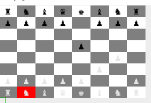

# Chess

## Description

Classic game of chess implemented to be played in the terminal, using object-oriented ruby programming.



## Technologies

- Ruby
- Singleton Module
- Cursorable

This game was created heavily using object oriented programming, utilizing inheritance through the different piece classes. The singleton pattern was used to manage empty pieces on the board to reduce instances of empty space objects and avoid type checking.

The game is played utilizing the Cursorable module to manage keyboard listeners.

The game required creating a deep duplicate of the chess board in order to check if any possible move created an instance of  check mate.

```ruby
def check_mate?(color)
  return false unless in_check?(color)
  @grid.each_with_index do |row, row_idx|
    row.each_with_index do |piece, col_idx|
      next unless piece.color == color
      piece.moves.each do |move|
        dup_board = dup
        dup_board.move([row_idx, col_idx], move)
        return false unless dup_board.in_check?(color)
      end
    end
  end
  true
end
```
